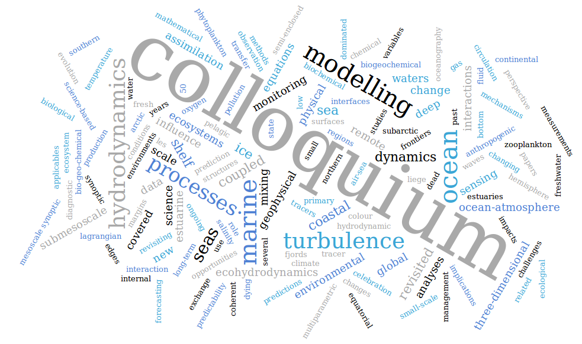
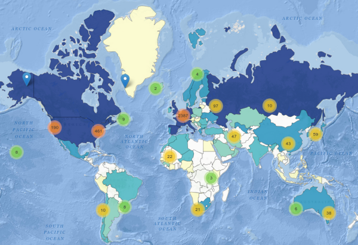
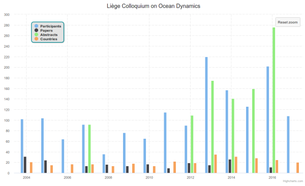

## International Liège Colloquium on Ocean Dynamics

This page is dedicated to historical data concerning the _International Liège
Colloquium on Ocean Dynamics_, organised since 1968 at the [University of Liège](https://www.uliege.be).
More informaton about the _Colloquium_ can be found at https://www.ocean-colloquium.uliege.be.

### 🏷️ List of topics

The previous topics are summarised in this [table](topics.md) and can be
visualised by clicking on the image. 

### 🗺️ Participation map

Spatial distribution of the participants: [choropleth](https://en.wikipedia.org/wiki/Choropleth_map), hexbin and heat maps.

### 📈 Time series

Time evolution of the number of participants, number of abstracts submitted and
papers published.

