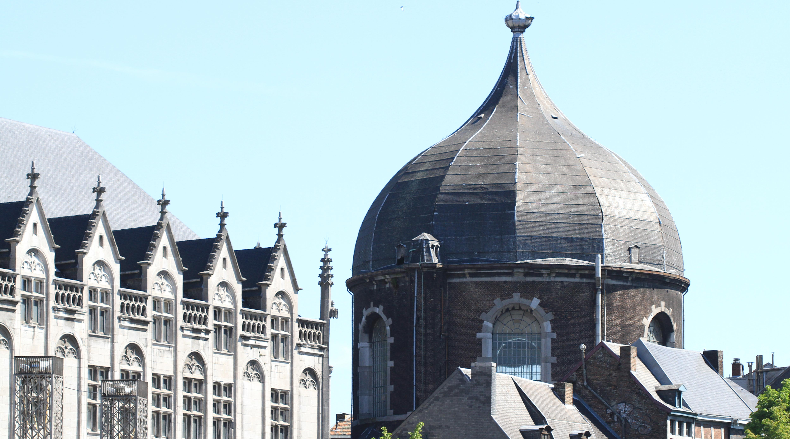
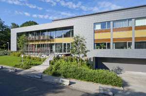
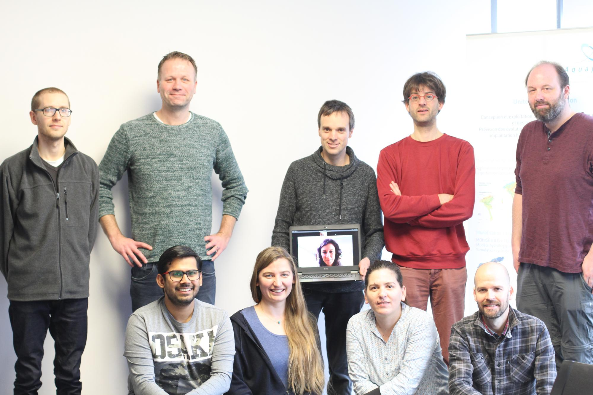

<head>
  <link rel="stylesheet" href="https://cdnjs.cloudflare.com/ajax/libs/font-awesome/4.7.0/css/font-awesome.min.css">
  <link rel="stylesheet" href="../assets/css/academicons.css">
</head>

# SeaDataCloud VRE code sprint

## <i class="fa fa-map-marker" aria-hidden="true"></i> - Where?

Sart-Tilman Campus, University of Liège, Belgium.     
The campus is located
* 7 km from the *Guillemins* train station
* 9 km from the town center.

The meeting room is located in the [Aquapôle (building B53)](https://www.campus.uliege.be/cms/c_1841773/fr/b53-aquapole).       
The closest bus stop is called *Polytech*.       
After crossing the main road, continue straight for about 200 meters.      
The building will be located on your left.

[How to get to the Sart Tilman campus?](../../Diva-Workshops/howtogetthere.md)      
[How to find the Aquapôle building?](./aquapole.md)

## <i class="fa fa-calendar-check-o" aria-hidden="true"></i> - When?

February 4-6, 2019

## <i class="fa fa-file-o" aria-hidden="true"></i> - Registration

The registration is done using [this form](https://goo.gl/forms/vzb8XKjd6onX96wy1).

## <i class="fa fa-bed" aria-hidden="true"></i> - Accommodations

Participants are invited to consult the following [list](http://labos.ulg.ac.be/gher/home/colloquium/colloquium-2019/venue/accommodation/).      
There is also a [residence](https://www.campus.uliege.be/cms/c_9109829/en/locations-temporaires) in the campus.
You need to fill and send [this form](https://www.campus.uliege.be/cms/c_9110790/fr/dtransit-1718-2017-04-06-15-45-28-404) for the booking.

## Preliminary program

### Monday (1 PM - 6 PM)
* Welcome by the organisers
* Working on the VRE
* Social Dinner

### Tuesday (9 AM - 6 PM)
* Working more on the VRE

### Wednesday (9 AM - 6 PM)
* Working even more on the VRE
* Conclusions, future milestones

### Before the meeting...

<i class="fa fa-plug" aria-hidden="true"></i> Bring power adapters if needed (<https://www.power-plugs-sockets.com/belgium/>).

<i class="fa fa-wifi" aria-hidden="true"></i> If your institution is part of [eduroam](https://www.eduroam.org/), be sure to have your credentials for the wifi connexion.

## <i class="fa fa-camera" aria-hidden="true"></i> - Pictures

[Photo album](https://photos.app.goo.gl/g7XaQ1ZiesNWd8gU8)

